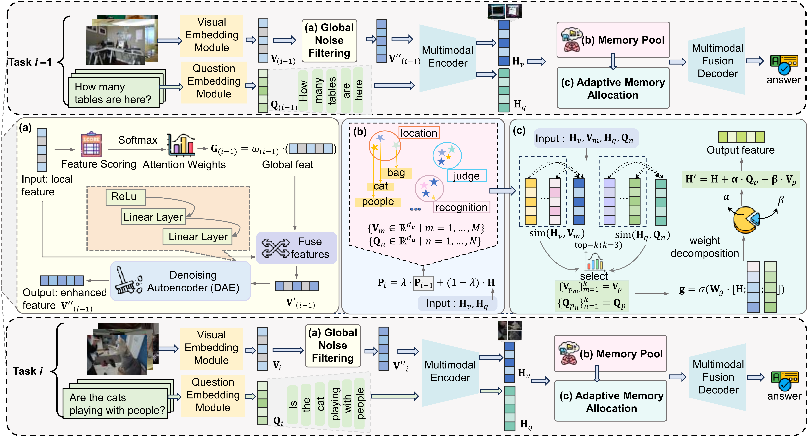

## 🔍 MacVQA: Adaptive Memory Allocation and Global Noise Filtering for Continual Visual Question Answering

**MacVQA** is a continual visual question answering framework designed to mitigate the challenges of catastrophic forgetting and cross-task interference in sequential multi-task settings. It introduces Global Noise Filtering and Adaptive Memory Allocation mechanisms to enhance task-specific representation learning and long-term knowledge retention. Key components include:(1) Global Noise Filtering: Suppresses irrelevant features from both images and questions. (2) Adaptive Memory Allocation (AMA): Dynamically selects task-relevant prototypes during inference.

<p align="center">
  
</p>

---

## ⚙️ Installation

You can set up the environment using the following command:

```bash
pip install -r requirements.txt
```

---

## 📁 Data Preparation

Download the required datasets and place them in the specified directories:

- Download the VQACL partition of **VQA v2** from [Google Drive](https://drive.google.com/file/d/11gx7AxyeMP1KVuzHErIfNKCLeBWGq3pE/view?usp=share_link) and put it into: `datasets/vqa/Partition_Q`
  

- Download `datasets/COCO` from [Google Drive](https://drive.google.com/drive/folders/1MBBhlkP83VMKS2Qe0SmFfzkHhMpIG5wf?usp=sharing)

---

## 🧪 MacVQA Task Execution

```bash
cd MAC-T5/

# Standard Training & Testing
bash scripts/MACVQA_train.sh 1      # Train on standard splits
bash scripts/MACVQA.sh 1            # Evaluate on standard splits

# Novel Composition Training & Testing (Group-5 setting)
bash scripts/MACVQA_NOV_train.sh 1  # Train on novel-task splits
bash scripts/MACVQA_NOV.sh 1        # Evaluate on novel-task splits
```
